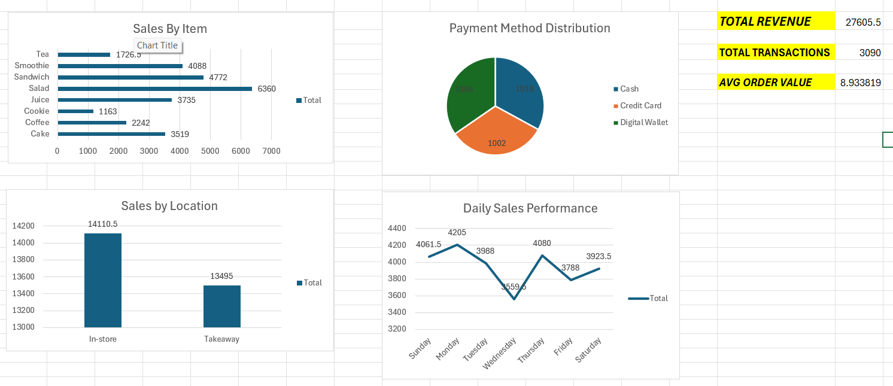

# Excel Sales Dashboard

## Overview

This project analyzes retail sales data using Microsoft Excel.

## Tools Used

- Microsoft Excel
- Pivot Tables
- Pivot Charts
- Dashboard
- KPI Analysis

## Dashboard Features

- Total Revenue
- Total Transactions
- Average Order Value
- Sales by Item
- Sales by Location
- Payment Method Analysis
- Daily Sales Performance

## Key Insights

- Identified best-selling products.
- Compared In-store vs Takeaway sales.
- Analyzed payment method distribution.
- Tracked daily sales trends.
## Dashboard Preview

